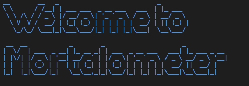

## Introduction
Probably you have heared or use the popular cliche: "Life is too short to engage in mundane trivialities!"
What if you can know the number of days you have already spent and the number of days you have left on planet earth,
would such information motivate or scare the crap out of you? ...

## How to use:
1. Creat a directory e.g `mdir my_fav_dir && cd my_fav_dir`
2. Creat a virtual environment e.g `python3 -m venv ~/.venv && source ~/.venv/bin/activate`
3. Clone the repo; `git clone https://github.com/ajakaiye33/mortalometer.git`
4. `cd mortalometer`
5. `make install`
6. `python mortalometer.py --name [your name,e.g 'Spencer'] --age [your age, e.g 31] --terminal_age[your desired age on earth,e.g 109] --country [your country name,e.g 'jamaica'] --sex [your sex,e.g 'Male']`
You can also run the script without arguements i.e `python martalometer.py` which isn't fun anyways as it print out one unknown Spenser's diagnosis.

> 45 years old Spencer from Jamaica, welcome! Though your desired terminal age is 98; Jamaica's life expectancy age for Males is 73.17.
> Phew,Spencer, you have spent 16425 days of your time already!
> Spencer, based on your desired terminal age of 98, you have 19345 days to mortality! Make each day count! Tick! Tock! Tick! Tock!
> Meanwhile, based on Jamaica's life expectancy age, you have 10282 days to mortality! Make each day count! Tick! Tock! Tick! Tock!

Also if you need help, like check whether your country is on the list, you may run, on your terminal: `python mortalometer --help`
